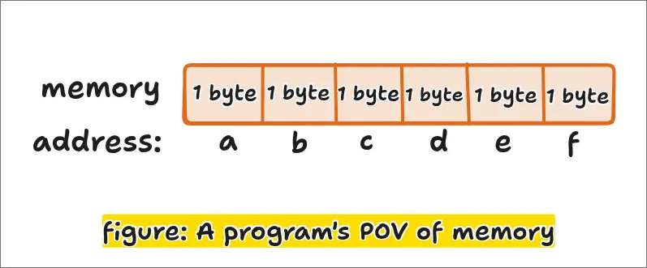

# 🧭 Represenation of Information

**Note:**

- A machine level program views memory as a very large array of bytes, reffered to as **virtual memory**.
- Every byte of the memory is identified by a unique number (represented in hex) called **address**.
- The set of all these possible addresses is known as the **virtual address space**.
