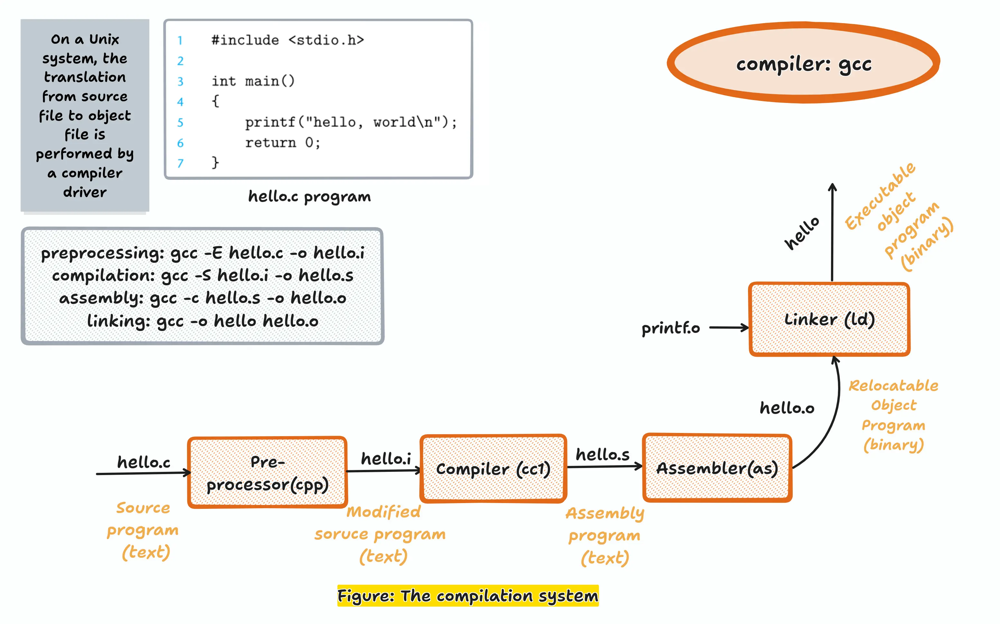
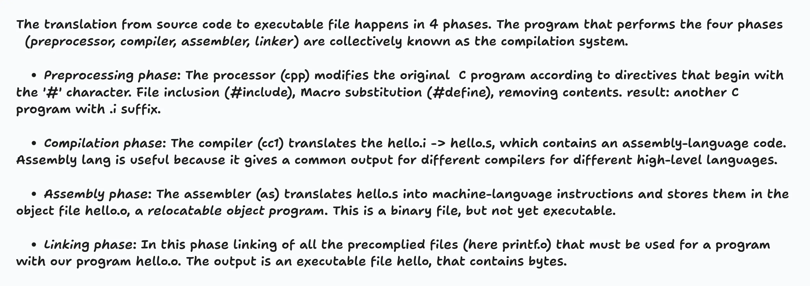

# 🧭 A Tour of Computer Systems

_A visual summary based on Chapter 1 of **Computer Systems: A Programmer’s Perspective** (CS:APP)._

This chapter takes us on a high-level tour of how a computer system executes a program — from source code to running machine.

---

## 🔹 1. Overview of a Computer System

**Note:**

---
